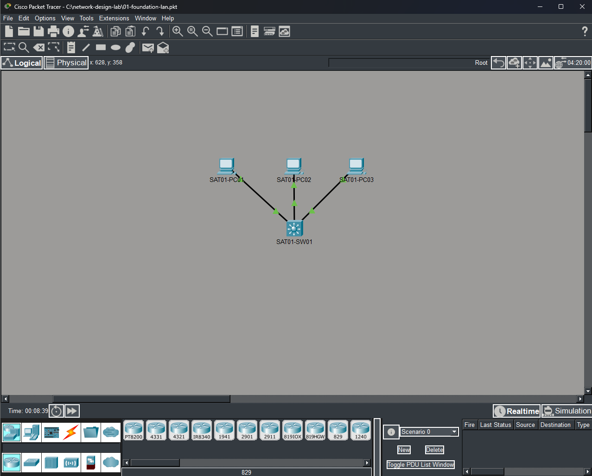
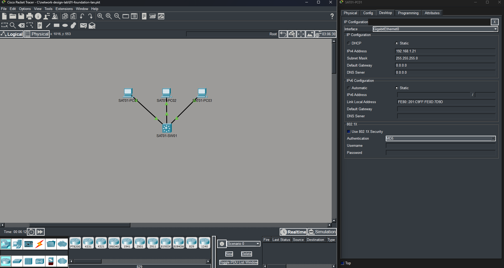
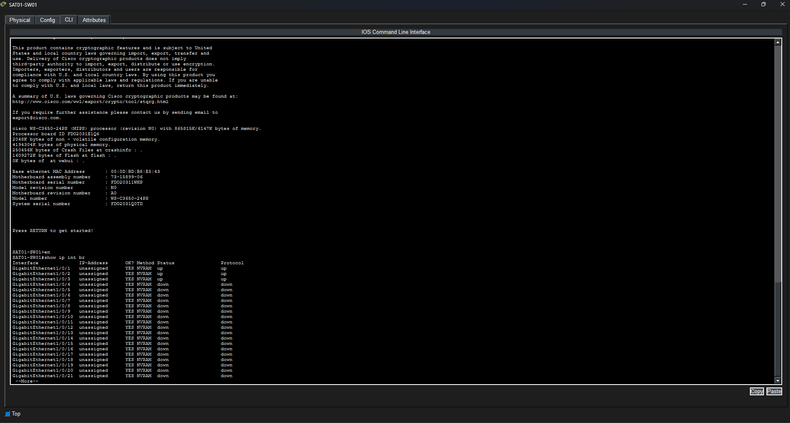
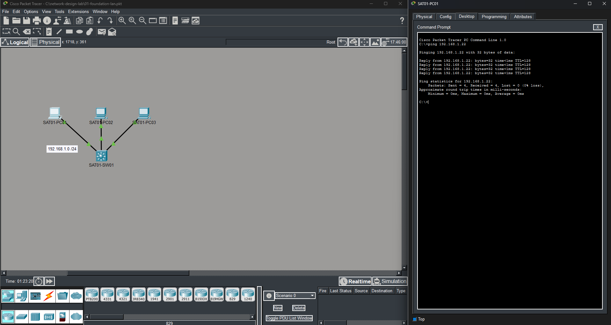
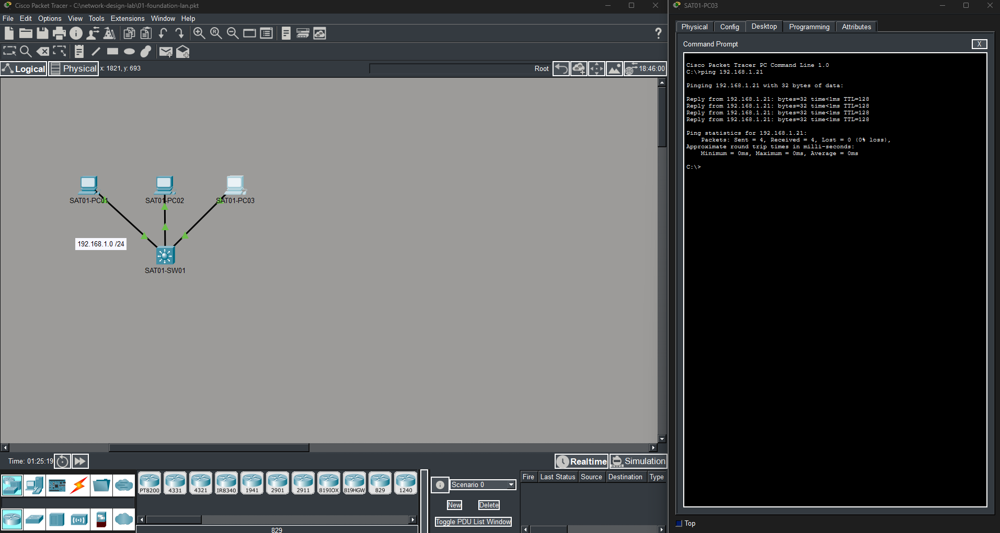

# 01-foundational-lan

## Objective

My primary objective for this iteration is to design and configure the initial LAN that will serve as the foundation for the larger network. The focus is on selecting appropriate switching hardware, configuring basic device settings/assigning IPv4 addresses, and establishing local connectivity.

Included below are personal notes (non-exhaustive) from my CCNA and Network+ studies that were especially useful in understanding and implementing this iteration.

- [CCNA Notes](./supplemental/01-ccna-notes.pdf)
- [Network+ Notes](./supplemental/01-netplus-notes.pdf)

---

## Design & Implementation

This section provides an overview of what I completed, the logical process used to complete each task, and the reasoning behind key implementation decisions. Screenshots are included for illustrative purposes.

### Step 1: Choosing Appropriate Hardware

I wanted to pick a piece of switching hardware that could grow with this project, and decided on the **Cisco Catalyst 3650-24PS**. I did a bit of research into the model names of the switching devices available in Packet Tracer and found that Cisco’s older Catalyst model numbers can provide some clues about their capabilities. For example, switches such as the Catalyst 2960 are primarily Layer 2 access switches, while models such as the 3560 and 3650 are multilayer switches capable of Layer 3 functionality. Cisco’s newer Catalyst 9000 series uses a different product structure, but perhaps I’ll circle back to that topic in a later iteration or separate lab.

Packet Tracer has a generic PC option that seemed suitable for this lab. I powered off each PC and replaced the default FastEthernet NIC with a Gigabit Ethernet-capable NIC so the end devices could use Gigabit Ethernet connections.

For the physical connections, I used **copper straight-through cabling**. Traditionally, straight-through versus crossover cabling depended on the types of devices being connected, but **auto-MDI/MDIX** makes that distinction largely irrelevant on modern Ethernet interfaces that support it.

### Step 2: Configuring Settings/Assigning IPv4 Addresses

To begin, I decided to use a **/24 IPv4 network** for the initial LAN. With this addressing scheme in mind, I configured each PC with an IPv4 address within the same subnet and applied the appropriate subnet mask.

I then configured an appropriate hostname on the switch, verified that the interfaces connected to the PCs were operational, and added descriptions to the connected interfaces to make their purpose easier to identify.

---

## Verification

Now it’s time to verify that this iteration is functioning as intended. As stated above, the primary objectives for this iteration were to select appropriate switching hardware, configure basic device settings and IPv4 addressing, and establish local connectivity.

To test functionality and confirm the success of my configurations, I will use `ping` to verify connectivity between the PCs. The remaining objectives were verified through the configuration and screenshots shown above.

### Verification Results

PC1 was able to successfully ping PC2, and PC3 was able to successfully ping PC1. This confirms that the hosts can communicate across the local network and brings this iteration to a successful conclusion.

**Result:** Successful

