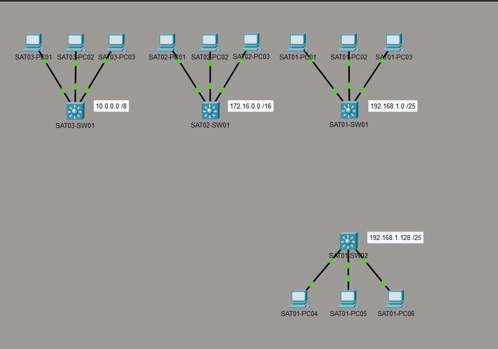
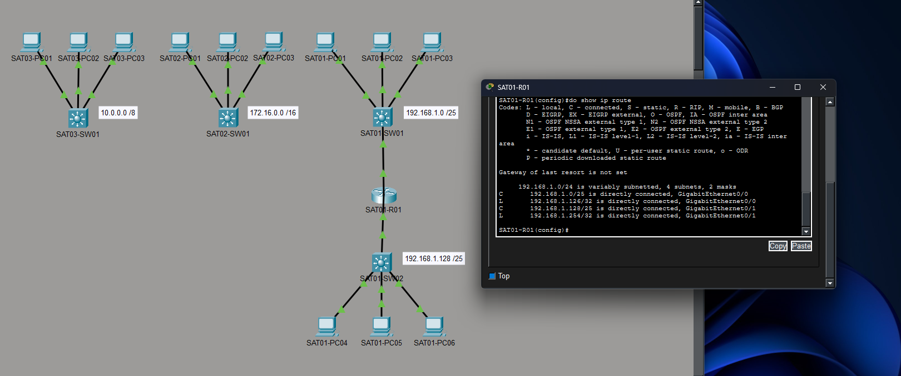
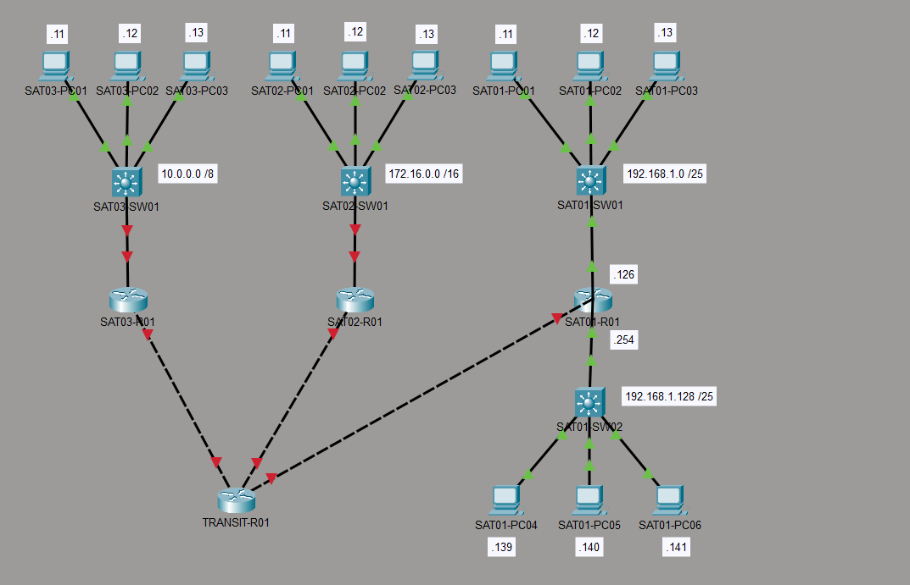
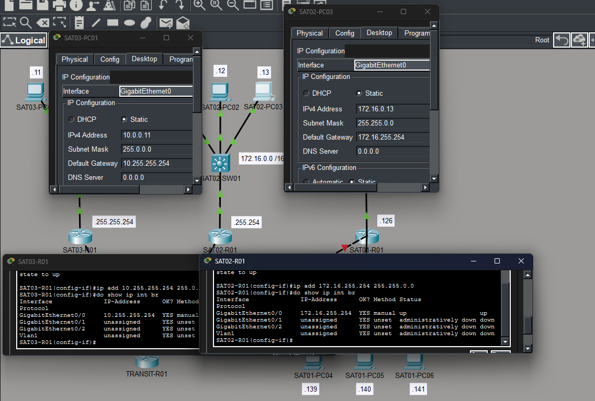
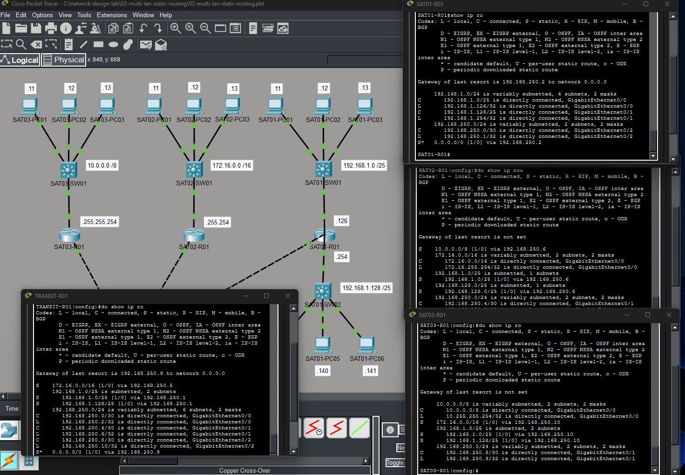
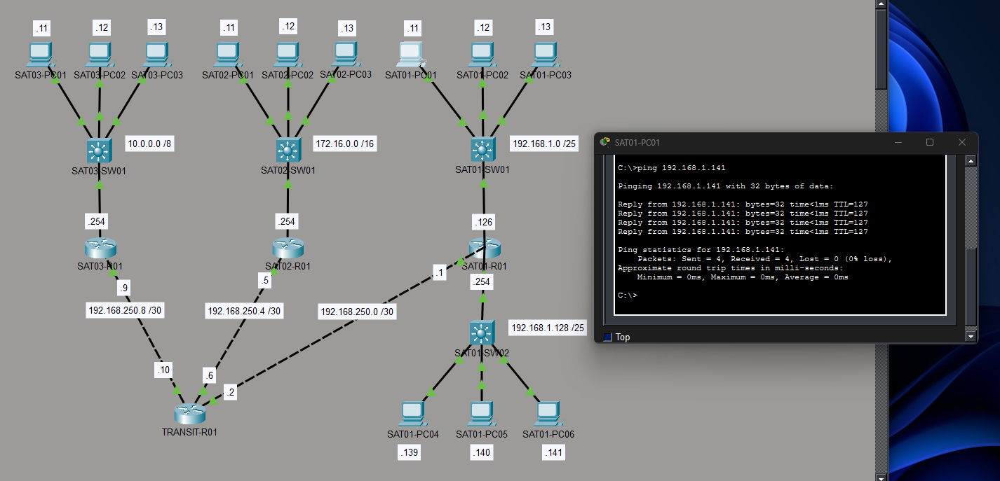
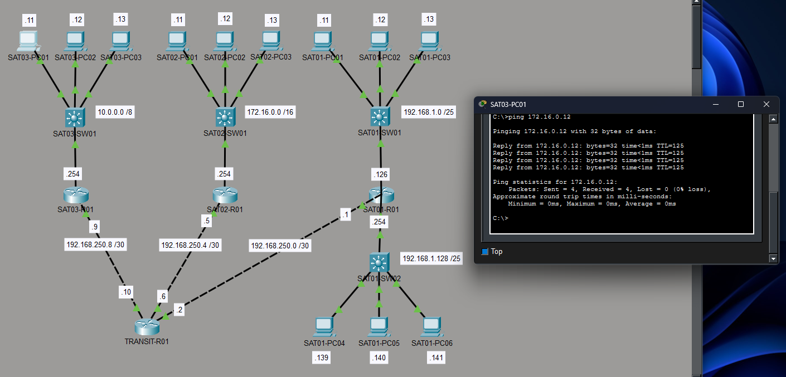
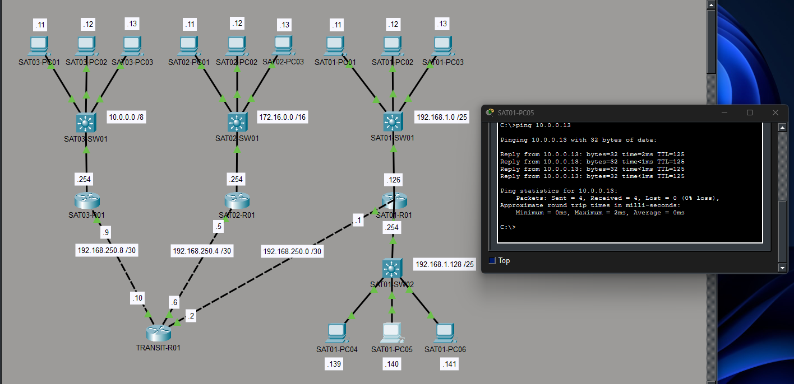
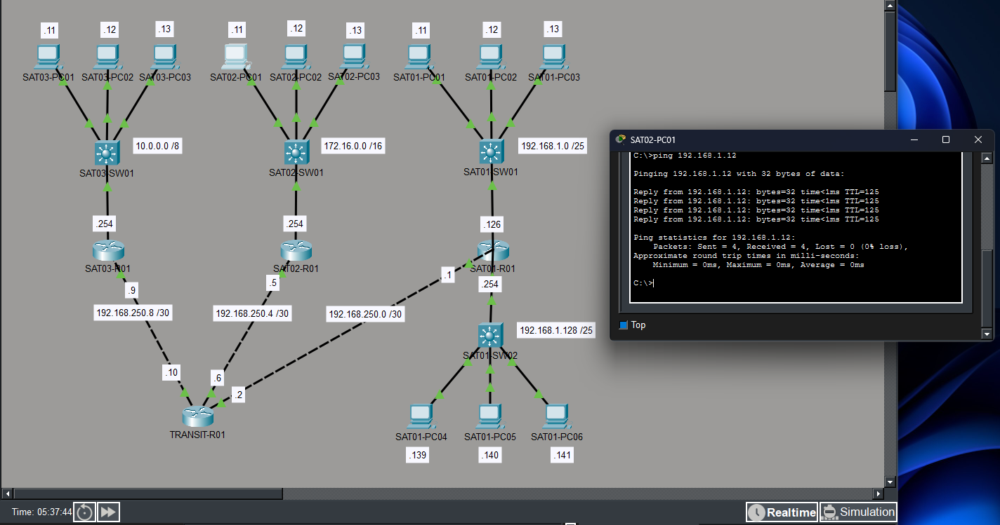
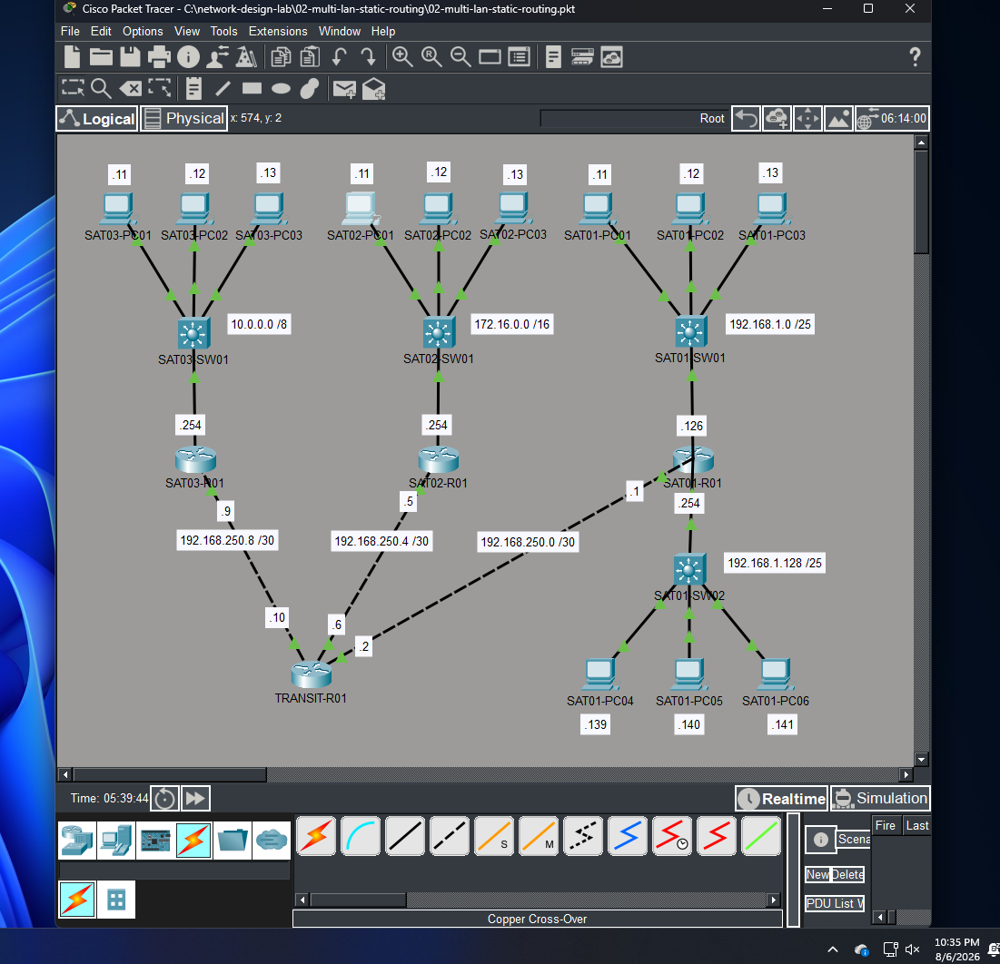

# 02 - Multi-LAN Static Routing

## Objective

My primary objective in this iteration was to create multiple LANs, establish L3 connectivity between them using static routes, and test the functionality of default routes.

Included below are personal notes (non-exhaustive) from my CCNA and Network+ studies that were especially useful in understanding and implementing this iteration.

- [CCNA Notes](./supplemental/02-ccna-notes.pdf)
- [Network+ Notes](./supplemental/02-netplus-notes.pdf)

---

## Design & Implementation

### Step 1

I began by creating two additional LANs, using /16 and /8 IPv4 addressing schemes and naming the devices within each LAN appropriately. For an extra challenge, I decided to split the original /24 network into /25 subnets to simulate an additional department being added within the same building as the original LAN.

### Step 2

Next, I placed SAT01-R01 between the two /25 networks and configured one interface as 192.168.1.126/25 and the other as 192.168.1.254/25. This allowed SAT01-R01 to act as the default gateway for each subnet and route traffic between them.

### Step 3

Originally, I had planned to use just three routers: one separating the simulated departments within the SAT01 site, and one each at SAT02 and SAT03. However, I was curious about how default routes worked. I understood theoretically that a default route acts as the least specific route providing a destination for a packet that matches no other more specific route, but I wanted to see that behavior in action within my own network.

I decided to place an additional router, TRANSIT-R01, between SAT01, SAT02, and SAT03. On TRANSIT-R01, I planned to configure specific static routes for two destinations while using a default route to forward traffic through the third path. Theoretically, this should still allow communication between all networks as long as the routing information and return paths were configured correctly.

### Step 4

I then assigned an appropriate IPv4 address to each router interface facing a LAN and went into each PC’s network settings to configure that router interface address as its default gateway.

### Step 5

The final step was to bring everything together, it was time to actually configure my frankenetwork. I had a logical framework for what needed to be done, but the closer I got to implementing everything, the more I realized I needed a checklist. There were a lot of moving parts and a lot of individual configurations that had to be correct for the network to function as intended.

I ended up spending a lot more time planning and organizing what needed to be configured than I did actually entering commands on the devices themselves.

Here was my checklist, excluding what I had already completed in earlier steps:

#### SAT01-R01
- Configure G0/0 IP address 192.168.1.126 /25
- Configure G0/1 IP address 192.168.1.254 /25
- Configure G0/2 IP address 192.168.250.1 /30
- Send all other traffic to 192.168.250.2 (default route)

#### TRANSIT-R01
- Configure G0/0 IP address 192.168.250.2 /30
- Configure G0/1 IP address 192.168.250.6 /30
- Configure G0/2 IP address 192.168.250.10 /30
- Send traffic destined for 192.168.1.0 /25 to 192.168.250.1
- Send traffic destined for 192.168.1.128 /25 to 192.168.250.1
- Send traffic destined for 172.16.0.0 /16 to 192.168.250.5
- Send all other traffic to 192.168.250.9 (default route)

#### SAT02-R01
- Configure G0/0 IP address 172.16.255.254 /16
- Configure G0/1 IP address 192.168.250.5 /30
- Send traffic destined for 192.168.1.0 /25 to 192.168.250.6
- Send traffic destined for 192.168.1.128 /25 to 192.168.250.6
- Send traffic destined for 10.0.0.0 /8 to 192.168.250.6

#### SAT03-R01
- Configure G0/0 IP address 10.255.255.254 /8
- Configure G0/1 IP address 192.168.250.9 /30
- Send traffic destined for 192.168.1.0 /25 to 192.168.250.10
- Send traffic destined for 192.168.1.128 /25 to 192.168.250.10
- Send traffic destined for 172.16.0.0 /16 to 192.168.250.10

---

## Verification

The routing table outputs were a good indicator that I had completed my checklist, and I believed I had crossed every t and dotted every i, but the real test was the ALMIGHTY PING.

I needed to verify connectivity between every LAN. Each network had to be able to successfully send and receive ICMP traffic to confirm that routing was functioning end to end.

### SAT01-PC01 (192.168.1.11 > 192.168.1.141) SAT01-PC06

### SAT03-PC01 (10.0.0.11 > 172.16.0.12) SAT02-PC02

### SAT01-PC05 (192.168.1.139 > 10.0.0.13) SAT03-PC03

### SAT02-PC01 (172.16.0.11 > 192.168.1.12) SAT01-PC02

### Verification Result: Success

